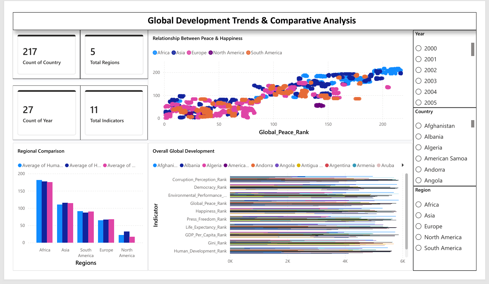
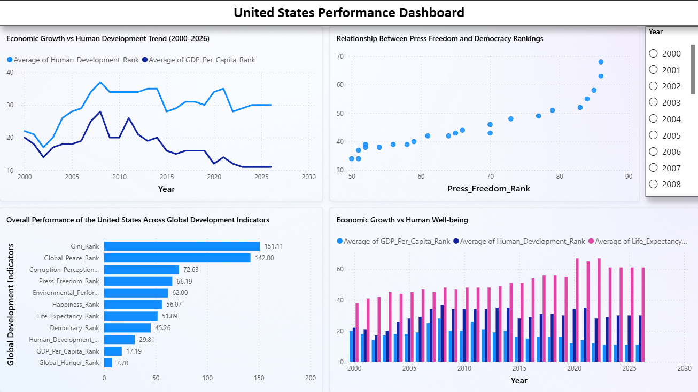

# 🌍 Global Development Analytics Dashboard (2000–2026)

An interactive Power BI dashboard analyzing the long-term development of **217 countries** across **11 internationally recognized global indicators** from **2000 to 2026**.

Instead of focusing on individual rankings, this dashboard answers key analytical questions by uncovering relationships between economic growth, governance, human development, and regional performance.

---

# 📸 Dashboard Preview

## Global Development Dashboard



---

## United States Performance Dashboard



---

# 🎯 Project Objective

To transform raw global ranking data into meaningful business insights by identifying long-term trends, comparing regional performance, and evaluating how different development indicators relate to one another.

---

# 📊 Dataset Summary

- **Countries:** 217
- **Time Period:** 2000–2026
- **Records:** 5,859
- **Regions:** 5
- **Indicators:** 11 International Development Rankings

Each indicator is represented as a ranking where **Rank 1 indicates the best-performing country**.

---

# 🛠 Tools Used

- Microsoft Power BI
- Power Query
- DAX
- Microsoft Excel

---

# 📈 Questions & Dashboard Insights

---

## 1️⃣ Do countries with better Global Peace rankings also tend to have better Happiness rankings, or are there exceptions?

**Visualization:** Scatter Plot

### Dashboard Insight

The scatter plot shows a generally positive relationship between Global Peace and Happiness rankings. Countries with stronger peace rankings often achieve better happiness rankings, suggesting that peaceful societies are commonly associated with higher overall well-being.

However, several countries deviate from this overall trend, indicating that national happiness is also influenced by economic, cultural, social, and political factors beyond peace alone.

---

## 2️⃣ Which Region Performs Better Across Multiple Development Indicators?

**Visualization:** Clustered Column Chart

### Dashboard Insight

Comparing regional averages across multiple indicators highlights clear differences in long-term development performance.

Rather than focusing on a single indicator, this analysis evaluates how regions perform collectively across economic, governance, environmental, and social dimensions, providing a broader understanding of regional strengths and development gaps.

---

## 3️⃣ Has the quality of life improved at the same pace as the economy?

### Context

Economic growth is often viewed as a measure of national progress. However, sustainable development also depends on improvements in education, healthcare, and living standards.

**Visualization:** Line Chart

### Dashboard Insight

Although GDP rankings improved over time, Human Development rankings did not always improve at the same pace.

This suggests that economic prosperity alone does not automatically translate into proportional improvements in overall quality of life, highlighting the importance of balanced national development strategies.

---

## 4️⃣ Has the United States translated its strong economic performance into improvements in Human Development over the last 27 years?

**Visualization:** Line Chart

### Dashboard Insight

The trend comparison between GDP per Capita Rank and Human Development Rank enables a long-term evaluation of whether economic growth has been accompanied by improvements in overall human well-being.

The analysis shows that while the United States consistently maintains strong economic performance, changes in Human Development are comparatively gradual, indicating that sustained economic strength does not always result in equally rapid improvements across broader development measures.

---

## 5️⃣ Do countries with greater Press Freedom consistently achieve stronger Democratic performance?

**Visualization:** Scatter Plot

### Dashboard Insight

The data points form a clear upward trend, indicating a strong positive relationship between Press Freedom and Democracy rankings.

Countries with better press freedom generally also achieve stronger democracy rankings.

Although the visualization does not establish causation, it suggests that transparent media environments are closely associated with stronger democratic institutions.

---

## 6️⃣ Which indicators have maintained the strongest overall rankings for the United States over the entire 2000–2026 period?

**Visualization:** Clustered Bar Chart

### Dashboard Insight

This visualization compares the United States across all 11 international development indicators over the full 27-year period.

Indicators such as **GDP per Capita**, **Human Development**, and **Global Hunger** consistently maintain stronger rankings.

In contrast, **Income Equality (Gini Rank)** and **Global Peace Rank** remain comparatively weaker, indicating that despite strong economic performance, challenges related to social equity and peacefulness continue to persist.

---

# 💡 Key Findings

- Better Peace rankings generally align with stronger Happiness rankings, although notable exceptions exist.
- Regional performance differs considerably when evaluated across multiple development dimensions.
- Economic growth alone does not always produce proportional improvements in human development.
- Press Freedom and Democracy demonstrate a strong positive association throughout the dataset.
- The United States consistently performs well in economic and development indicators but shows relatively weaker long-term rankings in income equality and global peace.

---

# 📂 Repository Contents

```
Global-Development-Analytics-Dashboard
│
├── 01_Global_Development_Analytics_Dashboard.pbix
├── 02_Dashboard_Overview.png
├── 03_United_States_Analysis.png
├── global_country_rankings_2000_2026.csv
└── README.md
```

---

# 🚀 Skills Demonstrated

- Data Cleaning & Transformation
- Power Query
- DAX Measures
- Interactive Dashboard Design
- Business Intelligence
- Data Visualization
- Comparative Analysis
- Trend Analysis
- Storytelling with Data
- Interactive Reporting

---

# 📚 Dataset Source

**Global Country Rankings Real Database (2000–2026)**

Source: Kaggle

https://www.kaggle.com/datasets/ashyou09/global-country-indices-real-database-2000-2026

---

# 👨‍💻 Author

**Aniket Gaikwad**

- LinkedIn: https://www.linkedin.com/in/aniket-gaikwad-ai-ml/
- GitHub: https://github.com/aniketg18
